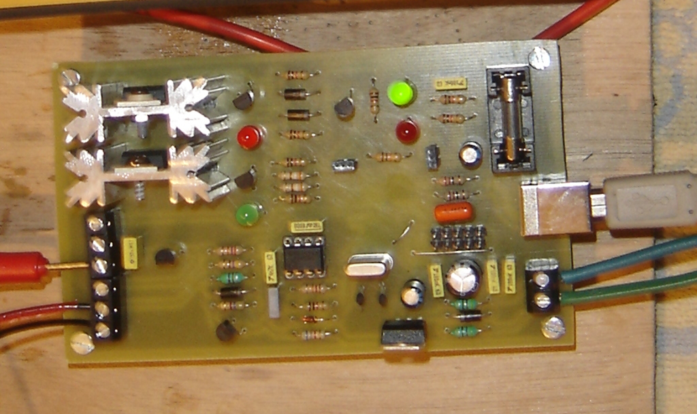
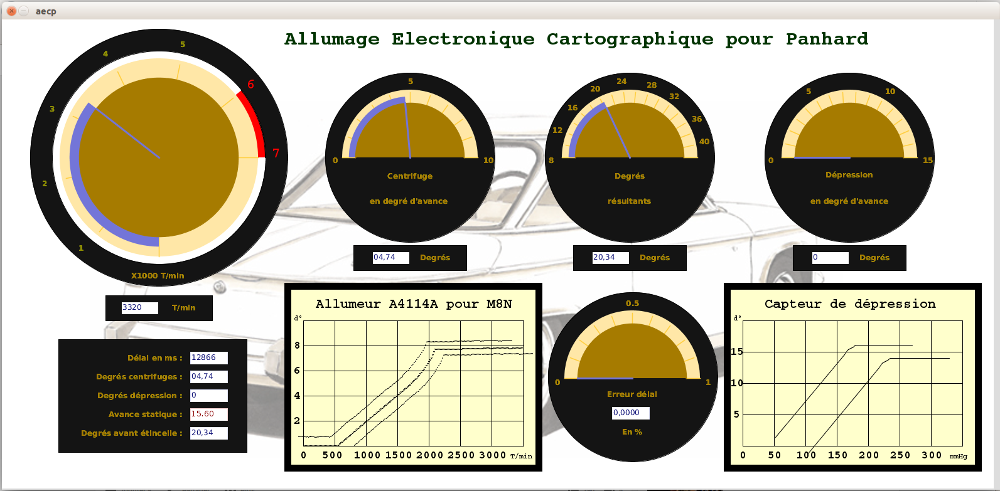
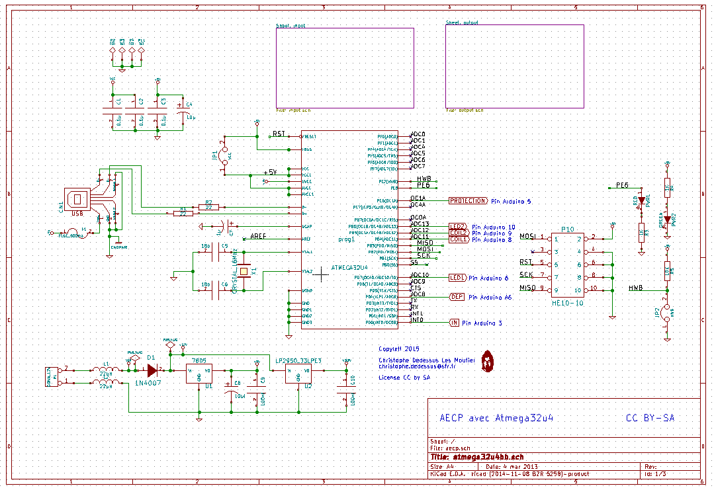
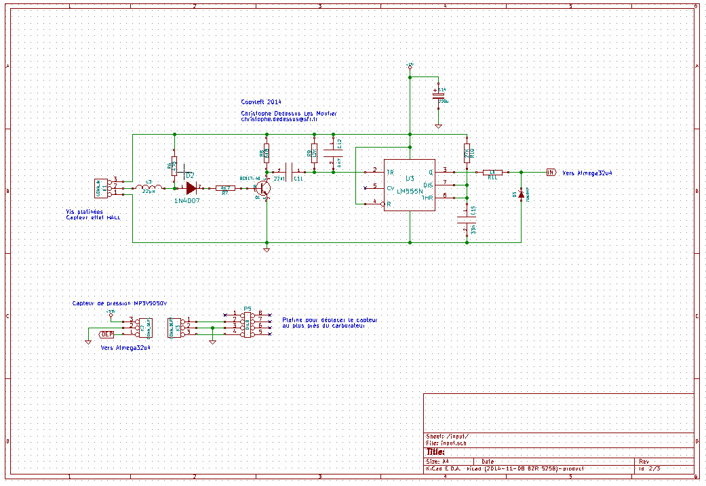
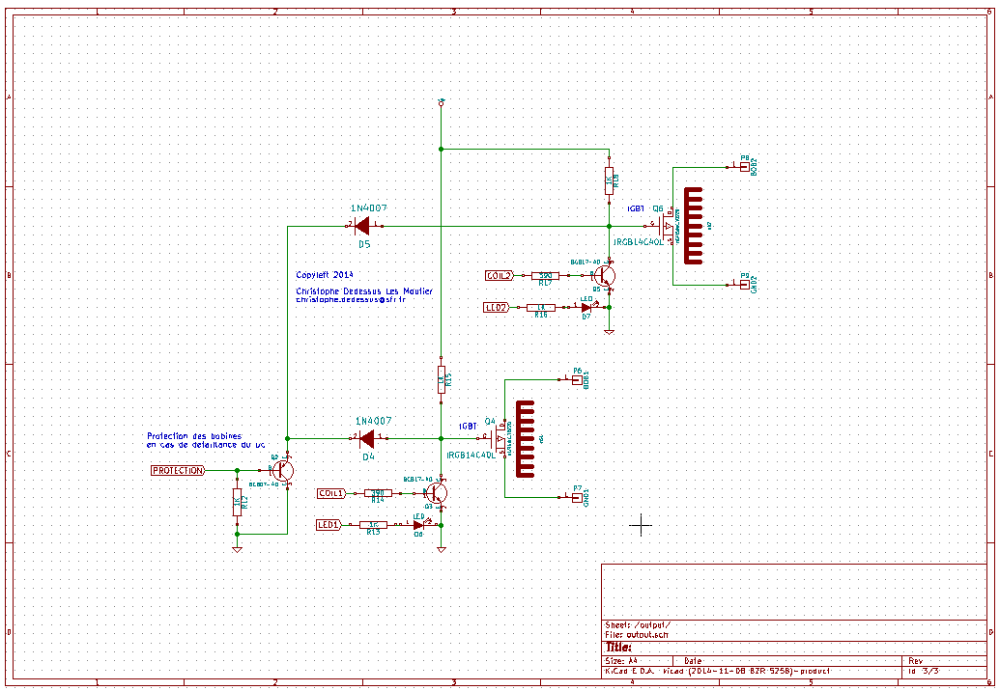

aecp
====

The project describes a electronic mapped car ignition
especialy for Panhard two cylindre

If you would have more information about this project please visit 
www.audiyofan.org

A link to the dedicated post 
http://www.audiyofan.org/forum/viewtopic.php?f=71&t=9221

PCB & schema are designed with Kicad

the board uses a Atmega32U4 and usb link to transmit some data to the PC

The idea comes from this site
http://a110a.free.fr/SPIP172/plan.php3

with this startpoint

The prototype of the board under kicad

To develop our electronic ignition, we create an interface
to receive data from the Atmega32U4 (recognized as a Arduino Leonardo) and visualize the centrifugal advance curves and vacuum advance

This interface is designed under Processing IDE and the board is programmed with Arduino IDE
All the files available in subfolders

For the printed circuit board please see the source_kicad folder 
or the build folder for a made version

For the schema see below

for the rest, I suggest you to navigate into folders and open the pdf

The main code is explained through comments ( in French) in the ino file ( see Arduino folder )

Enjoy

