aecp
====

The project describes a electronic mapped car ignition
especialy for Panhard two cylindre

If you would have more information about this project please visit 
www.audiyofan.org

A link to the dedicated post 
http://www.audiyofan.org/forum/viewtopic.php?f=71&t=9221

PCB & schema are designed with Kicad

the new board uses a Atmega328 and usb link to transmit some data to the PC
it's a Arduino Nano_V3

The idea comes from this site
http://a110a.free.fr/SPIP172/plan.php3

with this startpoint
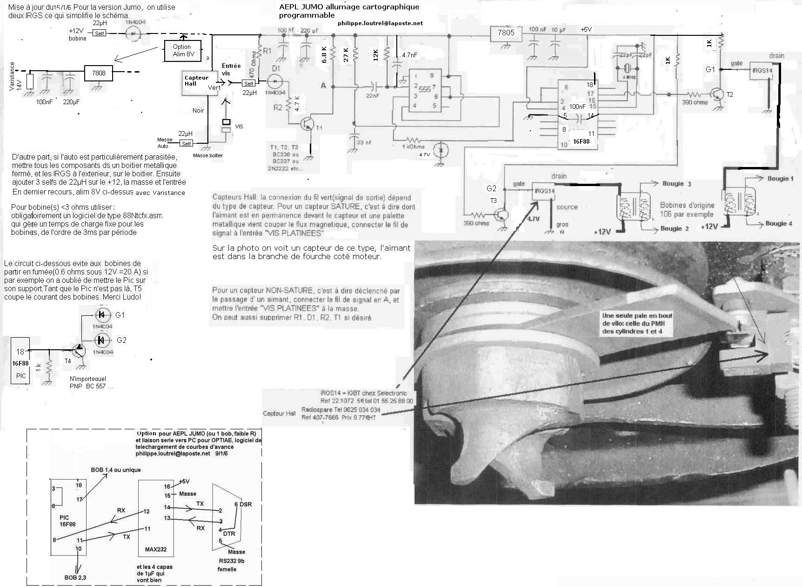

And finally with a Nano V3.0 with a dedicated page here
http://a110a.free.fr/SPIP172/article.php3?id_article=142

But this project have some child too for exemple 
https://github.com/michelm63/AEMM
with a dedicated post here
http://motos-anglaises.com/phpBB3/viewtopic.php?f=3&t=28953

The prototype of the new board under construction and under kicad

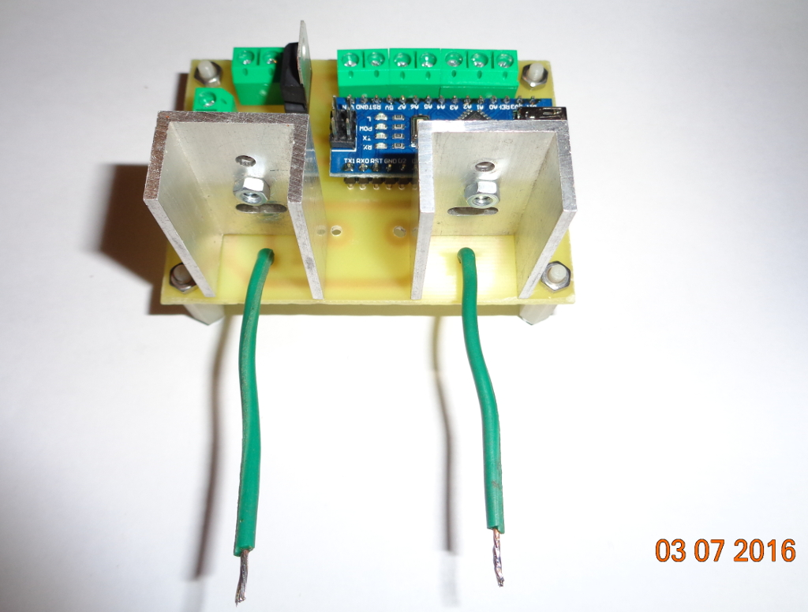
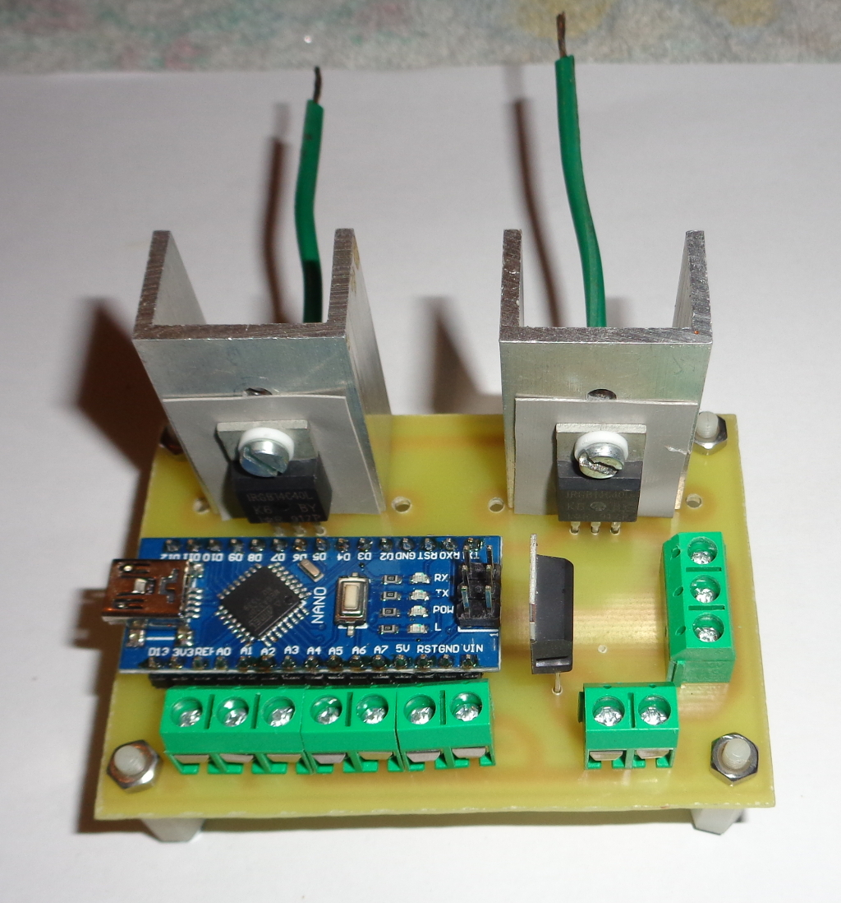

With some parts 

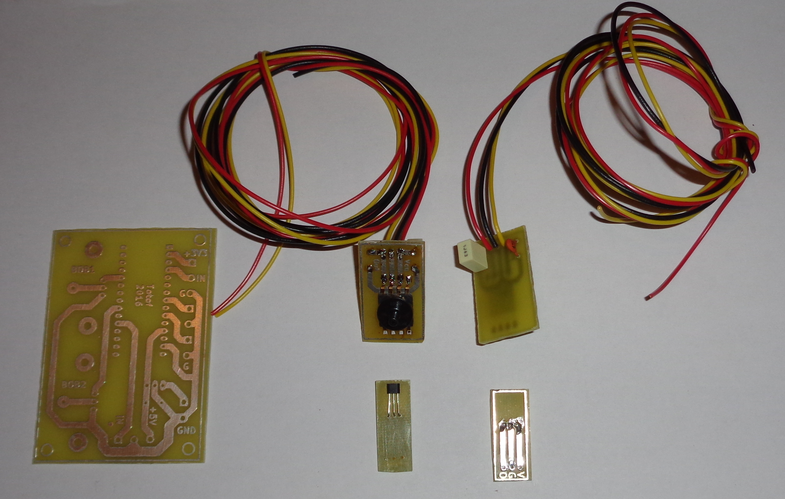

The new version of the PCB for longtime test

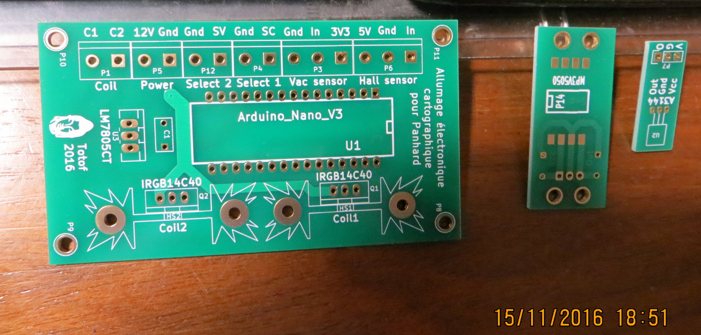
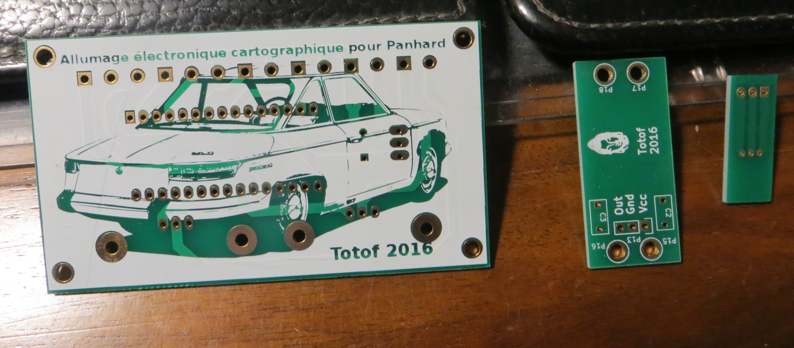

You can select different curve with a box

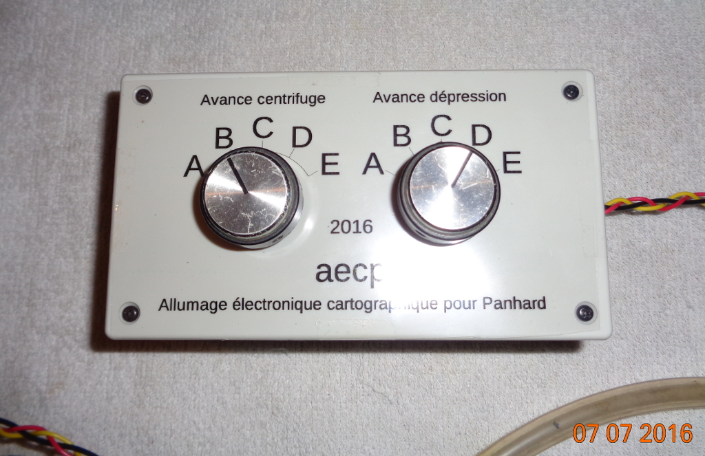

To develop our electronic ignition, we create an new interface with a Nano_V3
to receive data from the Atmega328 and visualize the centrifugal advance curves and vacuum advance

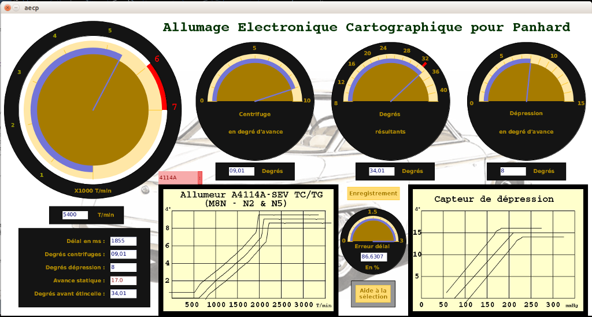
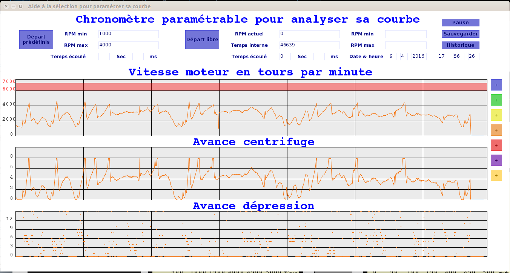
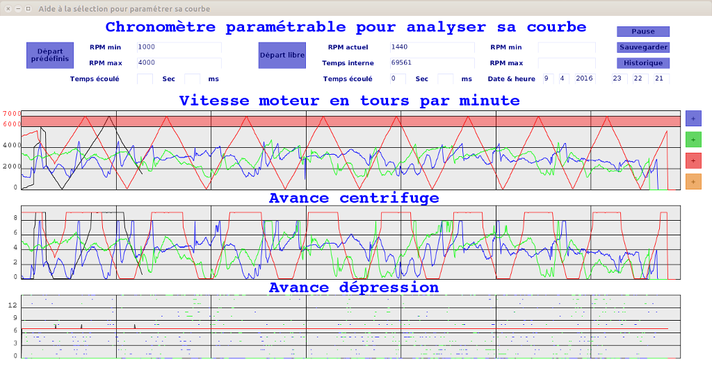

This interface is designed under Processing IDE and the board is programmed with Arduino IDE
All the files available in subfolders

For the printed circuit board please see the source_kicad folder 
or the build folder for a made version

For the schema see below

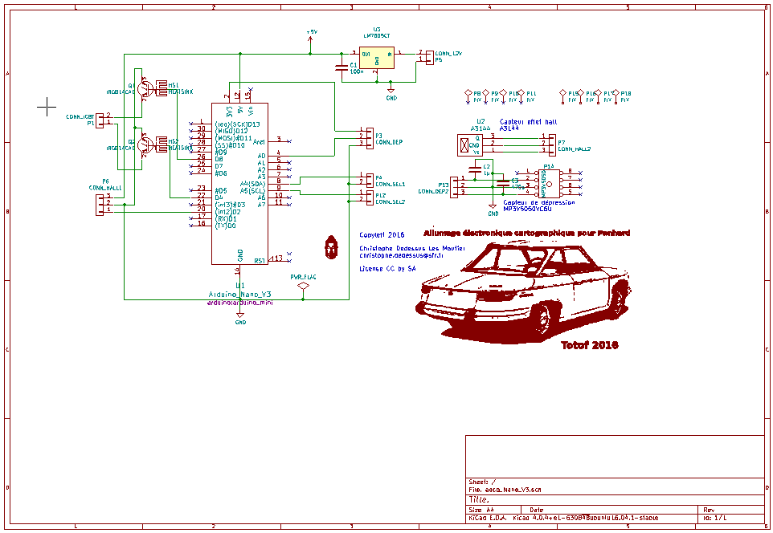

for the rest, I suggest you to navigate into folders and open the pdf

The main code is explained through comments ( in French) in the ino file ( see Arduino folder )

Enjoy

